# Веб сайт Виола
## Основа
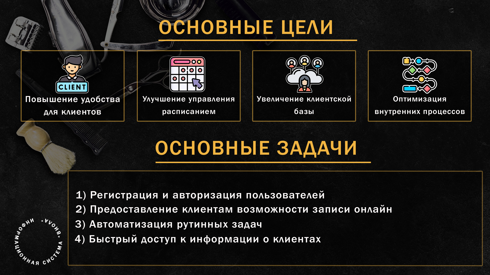 
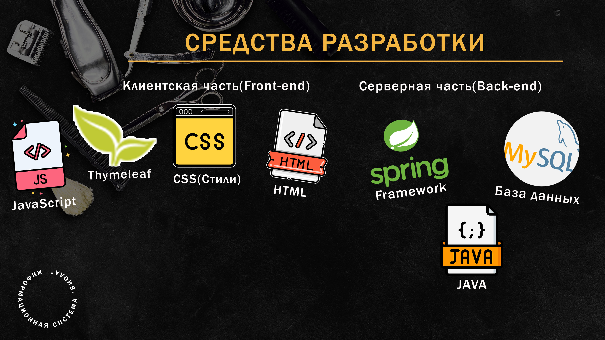 
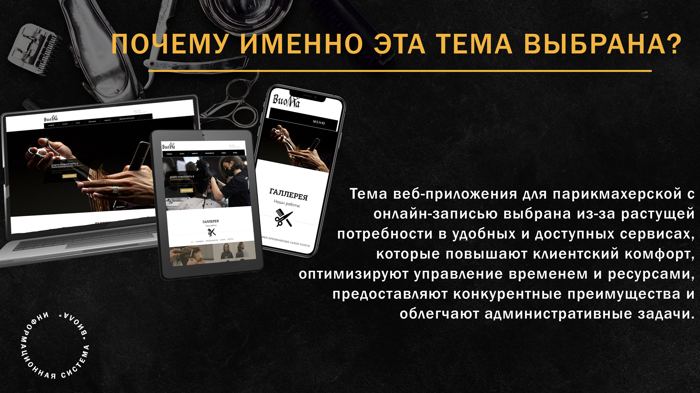
## Техническое задание
Система “Виола”. Информационная система для парикмахерской способна значительно оптимизировать и улучшить работу парикмахерской, как в целом, так и в каждой отдельной сфере.
### Общие сведения.
Назначение документа.
Настоящее Техническое задание определяет требования и порядок разработки web-сайта парикмахерской “Виола”.
Краткие сведения о компании.
Парикмахерская “Виола” предоставляет широкий спектр услуг по уходу за волосами и внешностью, направленных на создание и поддержание привлекательного образа клиентов.
До настоящего времени web-сайта у компании не было.
Основание для разработки сайта.
Основанием для разработки сайта является дипломное задание от 01.04.2024 года.
Плановые сроки начала и окончания работы по созданию сайта.
Начало работы: 01.04.2024 г.
Окончание работы: 13.06.2024 г.
### Назначение и цели создания сайта.
Назначение сайта.
Сайт должен предоставлять онлайн запись для парикмахерской “Виола” в Интернете.
Цели создания сайта.
Основные цели создания сайта.
Цель web-сайта — познакомить клиентов с парикмахерской, направлениями ее деятельности и услугами, предоставить информацию о записи онлайн на услуги.
Целевая аудитория.
В целевой аудитории web-сайта можно выделить следующие группы:
- мастера;
- клиенты.
### Требования к сайту.
Требование к структуре и функционированию сайта.
Сайт должен представлять собой информационную структуру, доступную в сети Интернет.
Сайт должен состоять из взаимосвязанных разделов с четко разделенными функциями.
Требования к персоналу.
Для поддержания сайта и эксплуатации веб-интерфейса системы управления от персонала не требуется специальных технических навыков или знаний технологий и программных продуктов. Исключение составляют лишь общие навыки работы с персональным компьютером и стандартным веб-браузером (например, Google Chrome). 
Требование к разграничению доступа.
Информация, размещаемая на сайте, является общедоступной.
Пользователей сайта можно разделить на 3 части с правами доступа:
1) Гость.
2) Пользователь.
3) Администратор.

Возможности гостя должны быть следующие:

1)	просмотр информации о парикмахерской.
2)	просмотр информации о контактах.
3)	просмотр информации об услугах.
4)	вход и регистрация на сайте.
Возможности пользователя расширяют возможности гостя и имеют следующие функции:
−	онлайн регистрация на услуги;
−	отмена регистрации на услуги;
−	просмотр истории посещений.
Возможности администратора расширяют возможности пользователя и имеют следующие функции:
-	добавление, редактирование и удаление пользователей;
-	добавление, редактирование и удаление категорий услуг;
-	добавление, редактирование и удаление услуг;
-	добавление, редактирование и удаление заявок на услуги;
-	смена статуса заявок на услуги.
Требования к функциям, выполняемым сайтом.
Основные требования.
Структура сайта.
Сайт должен состоять из следующих разделов:
-	о парикмахерской (главная страница);
-	услуги;
-	контакты;
-	новости;
-	авторизация и регистрация.

#### Навигация.
#### Главная страница.
#### О нас. 
Информация о парикмахерской, её миссия, история и преимущества.
Акции. Текущие специальные предложения, скидки и акции.
#### Услуги.
Стрижки и укладки. Подробное описание всех видов стрижек и укладок для женщин, мужчин и детей.
Окрашивание. Варианты окрашивания, включая мелирование, тонирование и креативное окрашивание.
Уход за волосами. Лечебные и спа-процедуры для волос.
Маникюр и педикюр. Услуги по уходу за ногтями и кожей рук и ног.
Косметология. Уход за кожей лица, включая чистку, пилинги и маски.
Депиляция. Восковая депиляция различных зон тела.
#### Мастера.
Команда. Фотографии и биографии мастеров, их специализация и опыт.
Отзывы. Отзывы клиентов о мастерах и их работе.
#### Галерея.
Фото работ. Примеры выполненных работ, до и после.
#### Запись онлайн.
#### Бронирование. 
Форма для онлайн-записи на услуги с возможностью выбора мастера и времени.
#### Личный кабинет. 
Доступ к истории записей и управление будущими визитами.
#### Цены.
Прайс-лист. Полный перечень услуг с указанием цен.
Пакетные предложения. Специальные наборы услуг по выгодной цене.
#### Контакты.
Адрес и карта. Местоположение парикмахерской на карте.
Контактная информация. Телефон, email, ссылки на социальные сети.
#### Блог.
Статьи. Полезные статьи и советы по уходу за волосами и кожей.
Новости. Последние новости и обновления парикмахерской.
Часто задаваемые вопросы (FAQ).
Ответы на наиболее часто задаваемые вопросы клиентов.
#### Футер сайта.
#### Политика конфиденциальности. 
Информация о защите данных клиентов.
Пользовательское соглашение. Условия использования сайта.
Подписка на новости. Форма для подписки на рассылку новостей и акций.
#### Наполнение сайта (контент).
На сайте парикмахерской представлена информация о парикмахерской, её услугах, мастерах и возможностях записи на услуги онлайн. 

Главная страница встречает посетителей приветственным баннером с основным предложением или акцией, кратким описанием парикмахерской и её уникальных преимуществ, а также актуальными акциями и новостями. На этой же странице находится кнопка для быстрой онлайн-записи.
Описание парикмахерской включает в себя историю, год основания, этапы развития, а также миссию и ценности, которые определяют философию работы и подход к клиентам. Команда мастеров представлена с фотографиями и краткими биографиями, чтобы клиенты могли узнать больше о специалистах, их опыте и специализациях. 
Для удобства клиентов предусмотрена онлайн-запись, где можно выбрать услугу, мастера и удобное время. Клиенты имеют доступ к личному кабинету, где хранятся история их записей, а также возможности управления будущими визитами, включая отмену или перенос записи. 
Цены на услуги представлены в виде подробного прайс-листа с указанием стоимости каждой услуги и специальных предложений, включая пакетные предложения и скидки. Контактная информация включает точный адрес парикмахерской с картой, телефон, email и ссылки на социальные сети.
На сайте также представлен блог с полезными статьями и советами по уходу за волосами, кожей и ногтями, а также новостями о событиях и мастер-классах. Часто задаваемые вопросы (FAQ) помогают быстро найти ответы на распространённые вопросы клиентов. 
В футере сайта размещены ссылки на политику конфиденциальности, пользовательское соглашение и форму для подписки на новости и акции. 
Система навигации (карта сайта).
Взаимосвязь между разделами и подразделами сайта (карта сайта) представлена на рисунке 1.1.

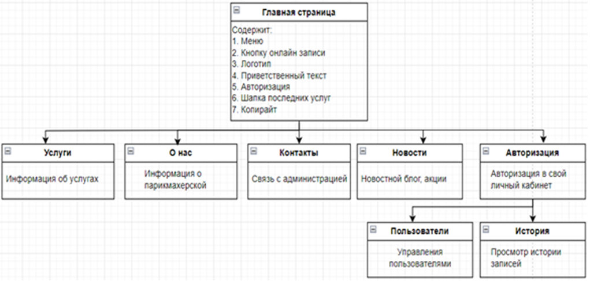

_Рисунок 1.1 — Карта сайта_

## Руководство пользователя
Cистема веб-сайта парикмахерской может включать функциональность, направленную на улучшение взаимодействия между клиентами и специалистами. Например, она может предоставлять возможность клиентам выбирать конкретного мастера для записи, основываясь на их портфолио, отзывах и доступности. Это способствует установлению доверительных отношений между клиентами и персоналом парикмахерской, что в свою очередь может привести к повышению лояльности клиентов и увеличению частоты посещений.
Система также может включать функционал управления инвентарем и продуктами, что помогает контролировать запасы и оптимизировать закупки. Это позволяет парикмахерской эффективно управлять своими ресурсами и обеспечивать клиентов необходимыми продуктами для ухода за волосами или стайлинга.
Это помогает оптимизировать рабочий процесс и уменьшает количество ненужного времени между клиентами.

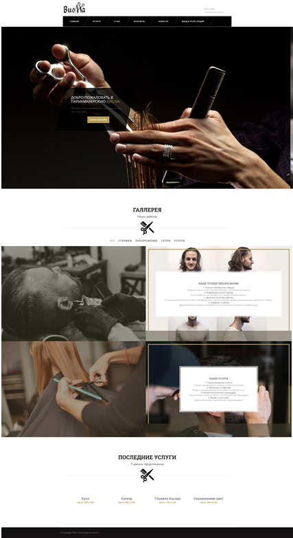

_Рисунок 1 – Главная страница_

На рисунке 1 изображена главная страница, где имеется баннер с приветствием и ключевым изображением, который привлекает внимание и устанавливает визуальный стиль сайта. Он может содержать призыв к действию, например, запись на прием.
Меню навигации. Расположенное в верхней части сайта меню предоставляет доступ к основным разделам, таким как услуги, галерея, отзывы и контактная информация. Это облегчает пользователям навигацию по сайту и быстрое нахождение необходимой информации.
 Галерея. Раздел с фотографиями примеров работ позволяет потенциальным клиентам оценить качество и стиль услуг парикмахерской. Галерея демонстрирует различные прически и стрижки, выполненные специалистами.
 Последние услуги. Этот блок предоставляет информацию о последних добавленных услугах или акциях. Он помогает держать клиентов в курсе новинок и специальных предложений.
С помощью меню навигации можно перейти на любую другую доступную страницу сайта, к примеру страницу услуг.
 
 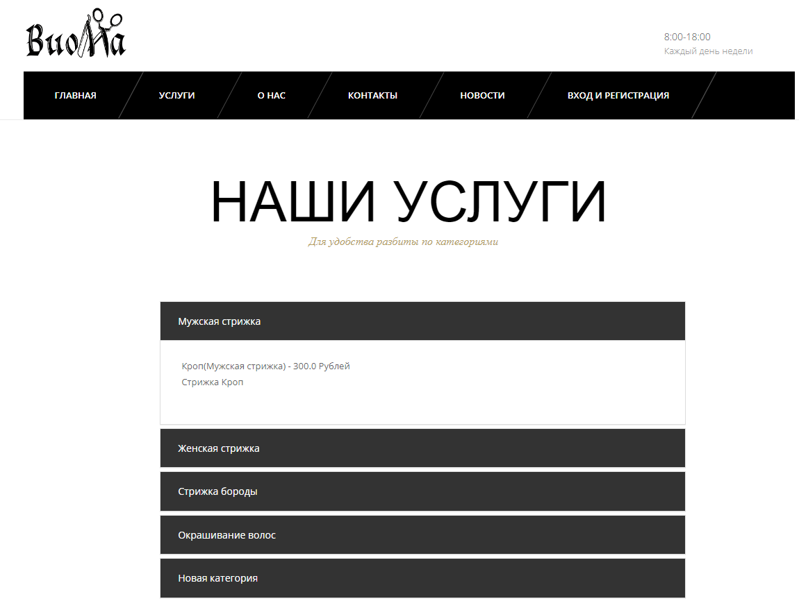

_Рисунок 2 – Страница услуг_

Страница, изображенная на рисунке 2, представляющая услуги парикмахерской, вы найдете полную перечень доступных услуг. Чтобы сделать поиск и выбор услуг более удобным для посетителей, мы разделили их на категории. Каждая категория выделена отдельно, что помогает легко найти нужную услугу. Меню оформлено в стиле, который обеспечивает ясность и удобство в использовании.
 
 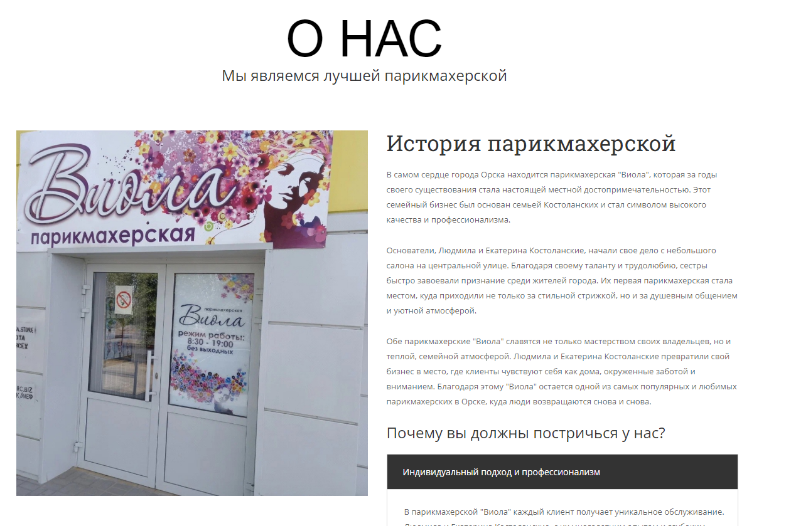

_Рисунок 3– Страница О Нас_

На странице “О нас”, изображенной на рисунке 3, вы найдете обширную информацию о нашей парикмахерской. Мы предоставляем краткую историю и интересные факты, отражающие суть и дух нашего заведения. Вы узнаете о том, как начиналась наша история, какие ценности мы привносим в нашу работу, а также о достижениях и наградах, которые получили за годы существования.
Чтобы сделать изучение информации более удобным, мы разделили её на категории, доступные через удобное меню. Такой подход помогает посетителям быстро находить интересующую информацию и погружаться в атмосферу нашей парикмахерской. 
 
 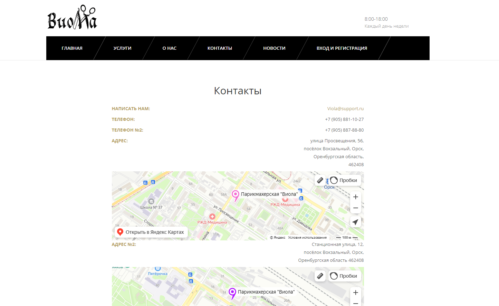
_Рисунок 4 – Страница контактов_

На странице контактов, изображенной на рисунке 4, вы обнаружите все необходимые сведения для связи. Здесь вы найдете наши телефоны и адреса электронной почты. Кроме того, представлены интерактивные карты с местоположением наших парикмахерских. Это поможет пользователю легко найти и добраться до заведения.

 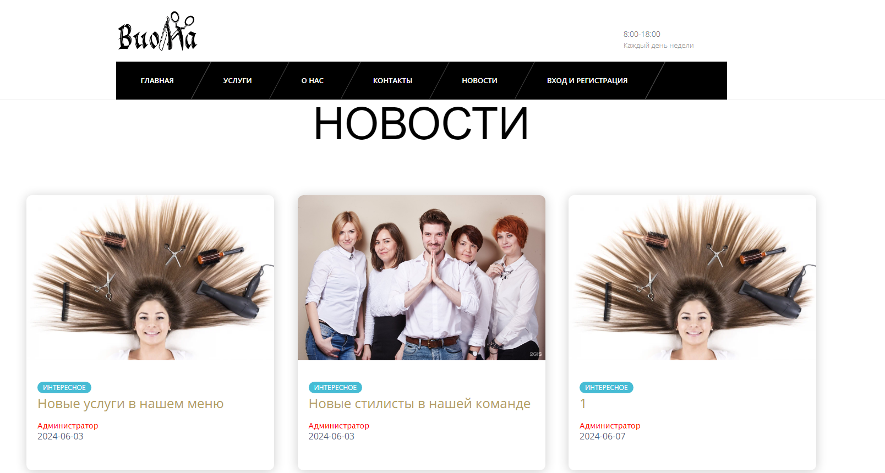

_Рисунок 5 – Страница новостей_
На странице новостей, изображенной на рисунке 5, вы обнаружите список последних новостей, включающий их название и дату публикации. Чтобы узнать больше о конкретной новости, нужно нажать кнопку "Подробнее" или на заголовок новости. 
Текст новости будет отображаться точно с теми же стилями, которые были заданы при ее создании.
На этом функциональность для гостя окончена, для продолжения работы требуется регистрация или вход в систему.
Перейдем на страницу регистрации, как показано на рисунке 6, и добавим нового пользователя, чтобы получить доступ к дополнительным функциям нашего сайта. 
Создадим нового пользователя в окне “Регистрация”. Вводим корректные данные, в другом случае выдаст ошибку. В системе присутствует проверка пароля и почты. В поле почты должен обязательно присутствовать символ “@”. Основные требования к паролю: 
- включать не менее 8 символов - включать маленькие и большие буквы латинского алфавита;
-  включать числа - специальные символы (типа %^& и т.д.);
- не должен быть связан с данными известными другим лицам (адреса, телефоны, дни рождения) - быть полностью рандомным.

  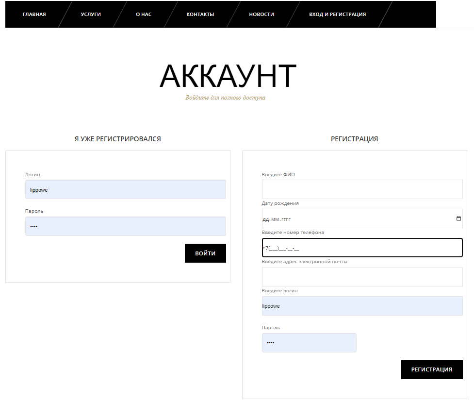

_Рисунок 6 – Страница входа и регистрации_

После заполнения всех данных и отправки их на сервер, мы получим уведомление об успешной регистрации, как показано на рисунке 7. И теперь можно выполнить вход в свой аккаунт.

  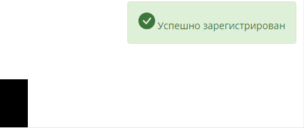

_Рисунок 7 – Уведомление об успешной регистрации_

После входа в аккаунт, изменится меню, отображаемое пользователю, а также добавится возможность бронирования услуги, как изображено на рисунке 8.
 
  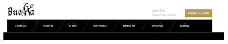

_Рисунок 8 – Вид меню для пользователя_

При переходе на страницу бронирования, изображенной на рисунке 9, требуется выбрать на какую дату и время будет бронь, и услуги из списка.

  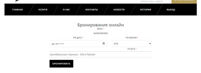

_Рисунок 9 – Страница бронирования_

После бронирования, текущая бронь, а также все предыдущие будут отображены на странице истории, где можно отслеживать их статус. Страница истории бронирования изображена на рисунке 10.
 
  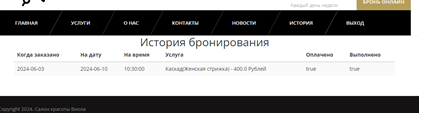

_Рисунок 10 – Страница истории бронирования_

При входе от имени администратора также изменятся пункты меню, как показано на рисунке 11.
Стоит сказать, что хоть визуально в меню пункт услуги не изменился, изменилось содержание страницы. Так, при переходе на эту страницу будут отображены список категории и список услуг.
 
  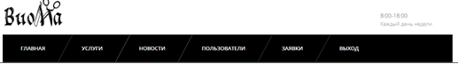

_Рисунок 11 – Вид меню для администратора_

Страница услуги, изображенная на рисунке 12, представляет собой:
-	добавление, редактирование и удаление категорий услуг;
-	добавление, редактирование и удаление услуг.
 
  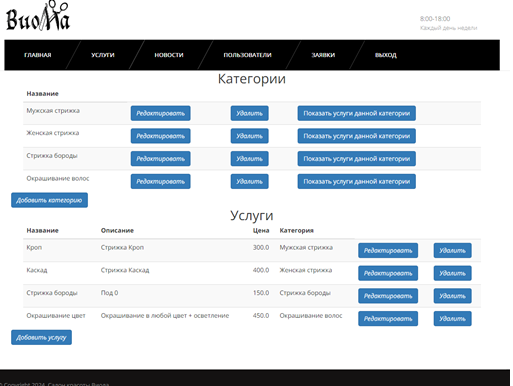

_Рисунок 12 – Страница услуг для администратора_

Для того чтобы добавить категорию, после всех категория имеется кнопка “добавить категорию”.
После добавления новой категории администратор вернётся на исходную страницу, где будет создана новая категория.
Для показа услуг только одной категории, нужно выбрать соответствующий пункт меню напротив нужной категории, как изображено на рисунке 13.

 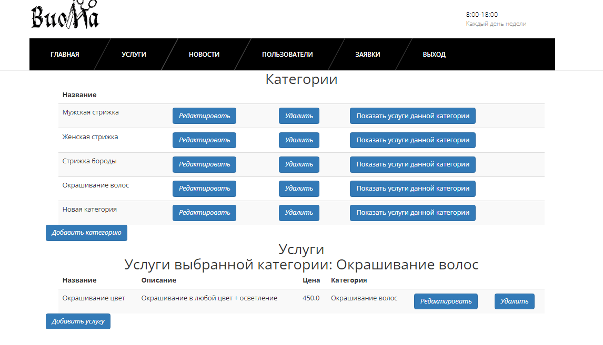

_Рисунок 13 – Фильтрация услуг выбранной категории_

Для добавления услуги стоит нажать кнопку добавления записи под таблицей. Страница добавления услуги изображена на рисунке 14. Как можно было заметить, недавно добавленная категория также отображается в списке.

 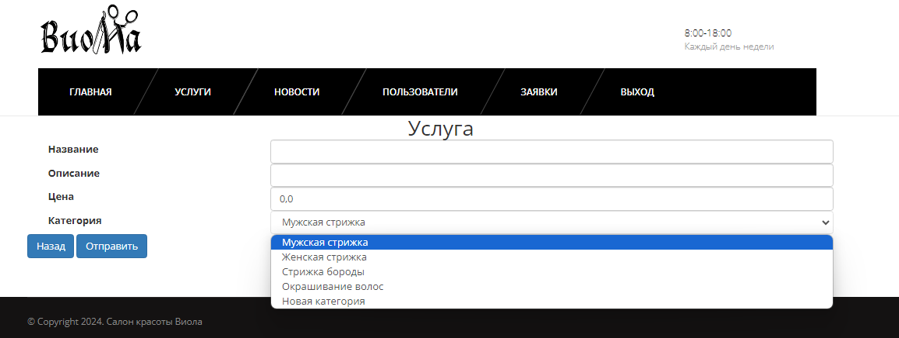
_Рисунок 14 – Страница добавления услуги_

При переходе на страницу новостей, изображенной на рисунке 15, от имени администратора, ему доступна работа с записями.
 
 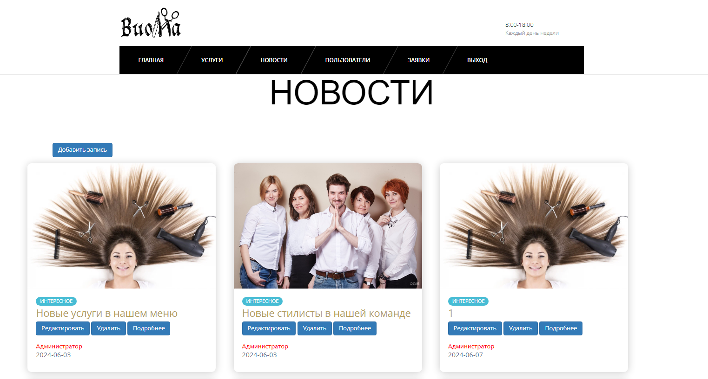

_Рисунок 15 – Страница новостей для администратора_

Стоит сказать, что для добавления текста записи используется специальное поле, которое поддерживает форматирование текста. Т.е. можно даже отформатировать текст в Word, настроить разные цвета, выделения, отступы, все это скопировать в поле и отправить. И текст новости будет отображаться точно так же.
На главной странице новостей администратору предоставляется возможность:
-	добавить новую новость;
-	редактировать существующую новость;
-	удалить существующую новость;
-	просмотреть существующую новость.
Для добавления новой новости стоит нажать кнопку добавления записи. Администратора перенаправляет в форму создания новой новости, как изображено на рисунке 16.

 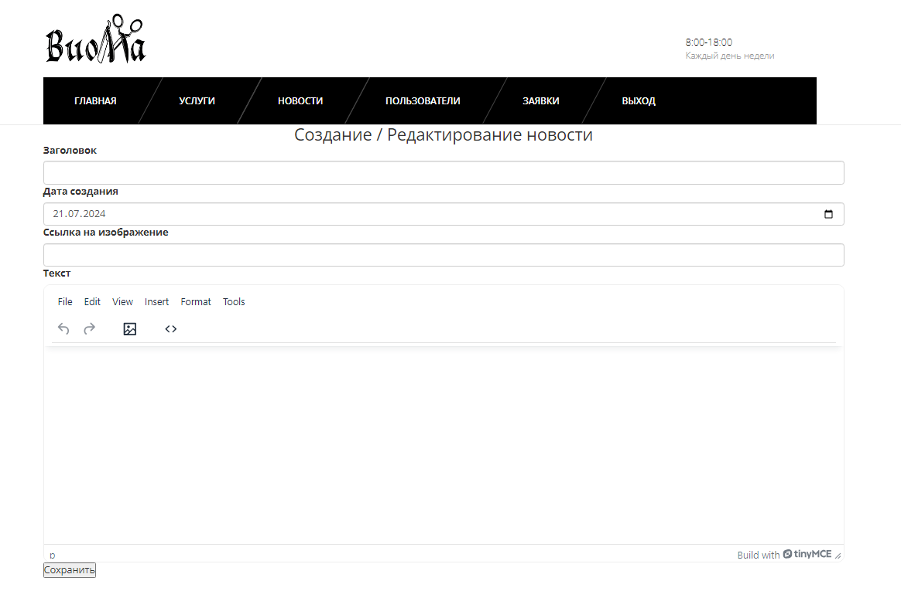
_Рисунок 16 – Страница создания новой новости_

После добавления новой новости она отображается во всех новостях и сохраняется в базу данных.
Для редактирования записи вас перенаправит на такую же форму, как изображено на рисунке 16. Для этого достаточно возле новости нажать на кнопку “Редактировать”.
Так же можно удалить новость одним нажатием по кнопку “Удалить”. Запись так же удаляется с базы данных.
Для работы с пользователями есть отдельная страница, которая изображена на рисунке 17, на которой можно просмотреть их список, изменить информацию или же удалить пользователя.
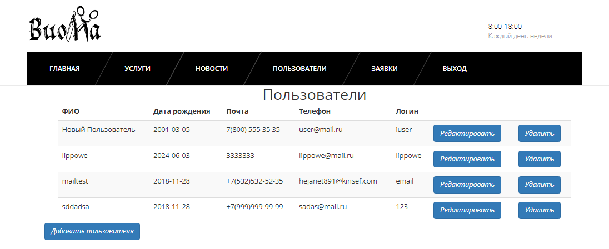

_Рисунок 17 – Страница управления пользователями_

Для добавление нового пользователя достаточно нажать на кнопку “Добавить пользователя”. При нажатии администратора перенаправляет на форму добавления нового пользователя, как показано на рисунке 18.

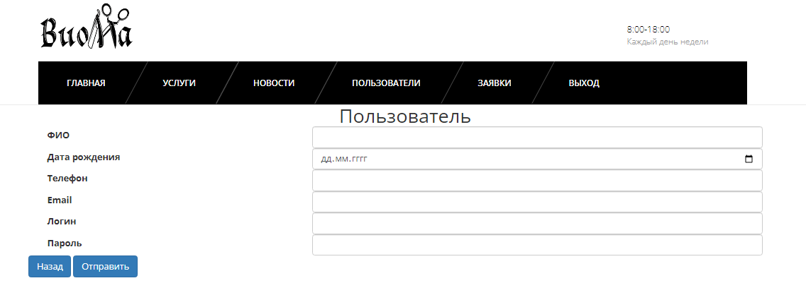

_Рисунок 18 – Добавления пользователя_

При переходе на форму редактирования пользователя, изображенной на рисунке 19, идёт перенаправление на форму с введёнными данными пользователя.

 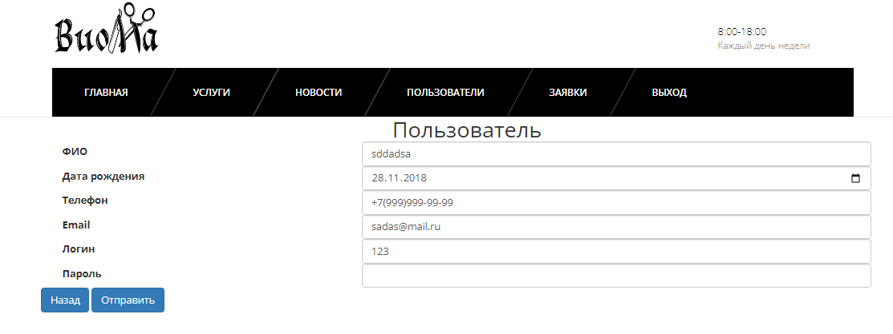

_Рисунок 19 – Редактирование пользователя_

На странице заявок, которая изображена на рисунке 20, отображены все брони пользователей. Можно изменить статусы оплаты и выполнения, так и удалить заявку.

 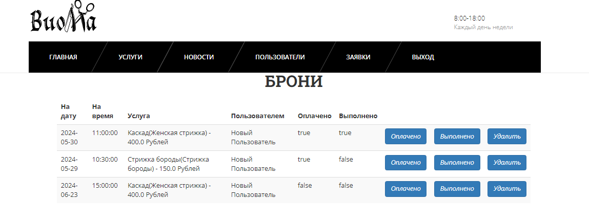

_Рисунок 20 – Страница заявок_
